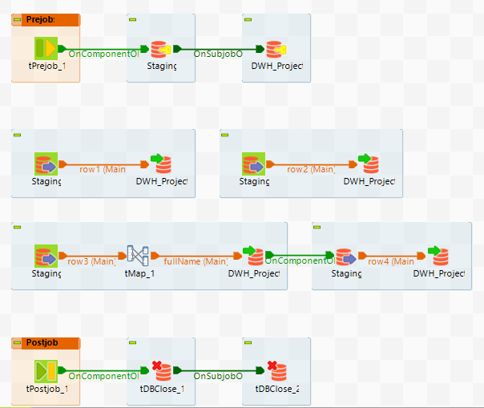
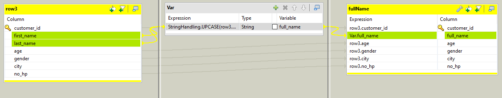

# Implementasi-Talend-Data-Warehouse

Solusi untuk Task 5 dari VIX Rakamin Data Engineer ID/X Partners oleh Wahyu Dwi Prasetio.

- File `DWH_Project.sql` merupakan file SQL yang berisi struktur tabel/skema dan data pada database DWH_Project. Data ini diperoleh dari proses ETL menggunakan aplikasi Talend.

- Folder `LOCAL_PROJECT` merupakan folder yang dihasilkan dari proses Export pada aplikasi Talend. Folder ini mengandung konfigurasi Transformasi dan Koneksi ke Database.


## Studi Kasus

Salah satu client dari ID/X Partners yang bergerak di bidang e-commerce memiliki kebutuhan untuk membuat sebuah Data Warehouse yang berasal dari beberapa tabel dari database sumber. Data Warehouse ini nantinya terdiri dari satu tabel Fact dan beberapa tabel Dimension. Sebagai Data Engineer, ada beberapa task yang perlu anda lakukan yaitu:

1. Melakukan Import/Restore Database Staging.

2. Membuat sebuah Database bernama DWH_Project, serta membuat Tabel Fact dan Dimension dari tabel yang ada di database Staging.

3. Membuat Job ETL di aplikasi talend untuk memindahkan data dari Staging ke Data Warehouse. Khusus untuk Tabel DimCustomer, lakukan transformasi data dengan merubah data dari kolom FirstName dan LastName menjadi huruf kapital semua, lalu gabungkan kedua kolom tersebut menjadi satu kolom yang bernama CustomerName.

4. Membuat Store Procedure (SP) untuk menampilkan summary sales order berdasarkan status pengiriman


## Penyelesaian Masalah

### Kasus 1

Restore database Staging dapat dilakukan melalui fitur “Restore” yang terdapat di aplikasi SQL Server Management Studio (SSMS). Klik kanan pada folder Databases lalu pilih “Restore Database”. Pada opsi sumber, pilih file Staging.bak yang telah tersedia, Selanjutnya klik “Ok” hingga proses restore selesai.


### Kasus 2

Database baru bernama DWH_Project dapat dibuat melalui aplikasi SSMS.

Pada database akan dibuat tabel dimension dengan nama 

- `DimCustomer`, 

- `DimProduct`, 

- `DimStatusOrder`, dan

tabel Fact dengan nama `FactSalesOrder`. Nama kolom dan tipe data dari setiap tabel akan disesuaikan dengan yang ada di Staging, dengan penulisan nama kolom mengikuti kaidah **Pascal Case**. Disamping itu, ditetapkan juga primary key dan foreign key pada setiap tabel Fact dan Dimension.

Sebagai informasi tambahan, `fact table` digunakan untuk menyimpan pengukuran kuantitatif dari proses atau peristiwa. Di sisi lain, `dimension table` memberikan konteks tambahan tentang data di fact table. Dengan menggabungkan fact table dan dimension table, data engineer dapat membangun model yang memberikan wawasan ke dalam data mereka.


### Kasus 3

Proses ETL yang dilakukan pada Talend dapat digambarkan seperti di bawah ini.



Pada proses migrasi data dari `Staging` ke `DWH_Project`, terlihat terdapat _hop_/aliran data dengan nama row1 hingga row4, di mana rincian dari masing-masing _hop_ tersebut ialah sebagai berikut.

- `row1(Main)`: Memuat dari tabel `product` pada database Staging ke tabel `DimProduct` pada database DWH_Project.

- `row2(Main)`: Memuat dari tabel `status_order` pada database Staging ke tabel `DimStatusOrder` pada database DWH_Project.

- `row3(Main)`: Memuat dari tabel `product` pada database Staging ke tabel `DimCustomer` pada database DWH_Project. Akan tetapi, Pada bagian ini dilakukan operasi tMap terlebih dahulu untuk menggabungkan nilai pada kolom `first_name` dan `last_name` sehingga menghasilkan full name yang nantinya akan menjadi kolom `CustomerName` pada tabel `DimCustomer` di database DWH_Project. Gambaran proses transformasi map terlibat sebagai berikut.
  
  

- `row4(Main)`: Memuat dari tabel `sales_order` pada database Staging ke tabel `FactSalesOrder` pada database DWH_Project.


### Kasus 4

Untuk membuat Stored Procedure tersebut, query yang dapat kita gunakan ialah sebagai berikut.

```sql
CREATE PROCEDURE dbo.summary_order_status
(
	@statusId int
)
AS
BEGIN
	SELECT OrderID, dc.CustomerName, dp.ProductName, fso.Quantity, dso.StatusOrder
	FROM dbo.FactSalesOrder fso
	JOIN dbo.DimCustomer dc 
		on dc.CustomerId = fso.CustomerId
	JOIN dbo.DimProduct dp
		on dp.ProductId = fso.ProductId
	JOIN dbo.DimStatusOrder dso
		on dso.StatusId = fso.StatusId
	WHERE fso.StatusId = @statusId;
END;
```

Untuk menjalankan SP tersebut, kita dapat memanggilnya dengan cara sebagai berikut.

```sql
use DWH_Project;

exec dbo.summary_order_status @statusId=1;
```


## Replikasi Penyelesaian Masalah di Talend

- untuk ekspor items: klik kanan di `job designs` -> `export items`
- untuk import items: buka toolbar, lalu pilih opsi `import items`


## References

- [Cara Membuat Koneksi ke Database MSSQL di Talend](https://blogs.perficient.com/2022/10/14/how-to-connect-sql-server-with-talend-tool/)

- [Migrasi Data dari Satu Database ke yang Lain Menggunakan Talend](https://www.youtube.com/watch?v=gC_UX1AkuiQ&t=574s)
